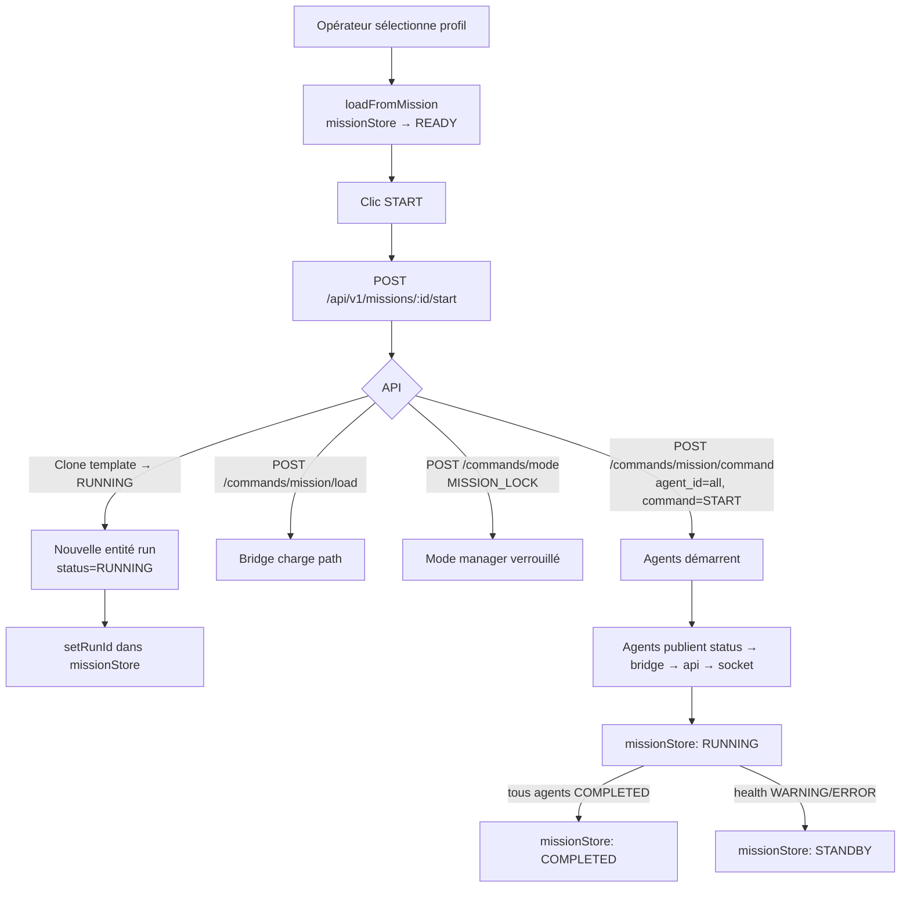
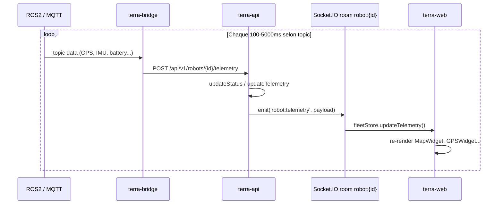
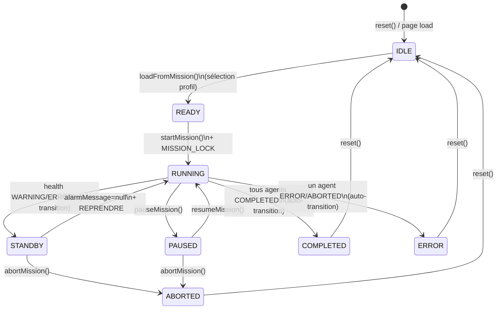

# TerraOS — Flux de données

## Flux principal : Télémétrie robot → Opérateur

```mermaid
flowchart LR
    subgraph ROBOT["🤖 Robot (embarqué)"]
        ROS[ROS2 Nodes\nFaucon stack]
    end

    subgraph BRIDGE["terra-bridge :8100"]
        direction TB
        T1[ROS2 DDS\nrclpy] -->|USE_MQTT=false| P[Push HTTP]
        T2[MQTT\npaho-mqtt] -->|USE_MQTT=true| P
    end

    subgraph API["terra-api :4000"]
        direction TB
        IC[Ingest Controller\nPOST /telemetry/*] --> GW[Socket.IO Gateway\nTelemetryGateway]
        DB[(SQLite / PostgreSQL)]
    end

    subgraph WEB["terra-web :3001"]
        FS[fleetStore\nZustand] --> UI[Dashboard\nWidgets]
    end

    ROS -->|DDS| T1
    ROS -->|MQTT :1883| T2
    P -->|HTTP POST| IC
    GW -->|WebSocket\nrobot:{id}| FS
```

---

## Flux : Commande opérateur → Robot

```mermaid
flowchart LR
    subgraph WEB["terra-web"]
        BTN[Bouton / Joystick] --> SOCK[Socket.IO emit]
    end

    subgraph API["terra-api"]
        GW[TelemetryGateway] --> SVC[Service métier]
        SVC -->|HTTP POST| BR[bridge endpoint]
    end

    subgraph BRIDGE["terra-bridge"]
        CMD[Router /commands/*] --> PUB[publish ROS2/MQTT]
    end

    subgraph ROBOT["Robot"]
        ROS[ROS2 topics]
    end

    SOCK -->|robot:joystick\nrobot:estop\nrobot:mode_request| GW
    BR -->|/commands/mission/command\n/commands/mode\n/commands/estop| CMD
    PUB -->|/teleop/ihm/cmd_vel\n/faucon/ihm/estop\n/mission/command| ROS
```



---

## Flux : Démarrage de mission



---

## Flux : Télémétrie temps réel (détail HTTP)



---

## Cycle de vie de la mission (state machine)



---

## Flux WebSocket — Événements

### Client → Serveur (depuis terra-web)

| Événement | Payload | Action |
|---|---|---|
| `robot:subscribe` | `{ robotId }` | Join room `robot:{id}` |
| `robot:unsubscribe` | `{ robotId }` | Leave room |
| `robot:joystick` | `{ robotId, linear, angular }` | → bridge cmd_vel |
| `robot:estop` | `{ robotId, active }` | → bridge estop |
| `robot:mode_request` | `{ robotId, type }` | → bridge mode/request |
| `robot:set_mode` | `{ robotId, mode }` | → bridge mode/set |
| `robot:mission_command` | `{ robotId, agentId, command }` | → bridge mission/command |

### Serveur → Client (broadcast dans room `robot:{id}`)

| Événement | Contenu |
|---|---|
| `robot:status` | mode, battery, connected, lastSeen |
| `robot:telemetry` | gps, imu, velocity, agentId (multi-agent GPS) |
| `robot:event` | type, msg, timestamp (log temps réel) |
| `mission:update` | state, currentWp, totalWp, missionId |
| `system:health` | level (OK/WARNING/ERROR), faults[] |
| `agent:status` | agentId, state, currentWp, totalWp |
| `orchestration:status` | état orchestrateur global |
