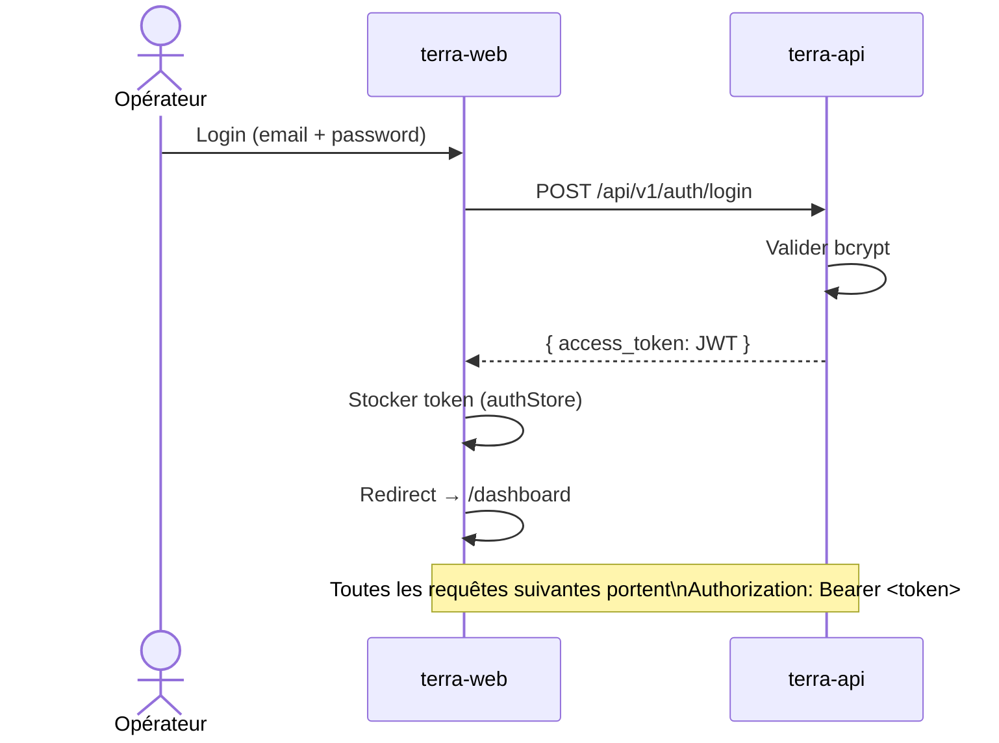
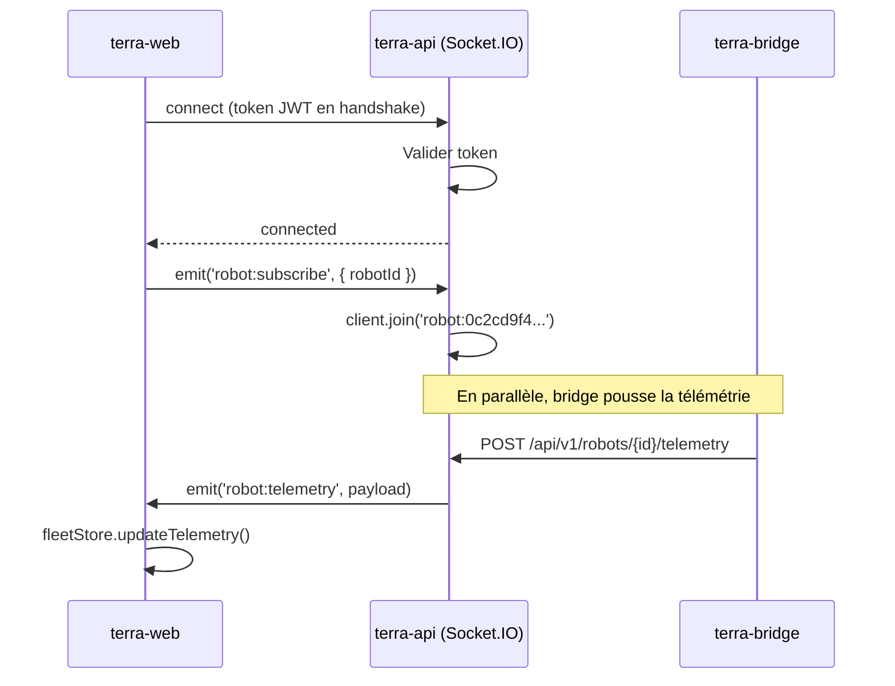
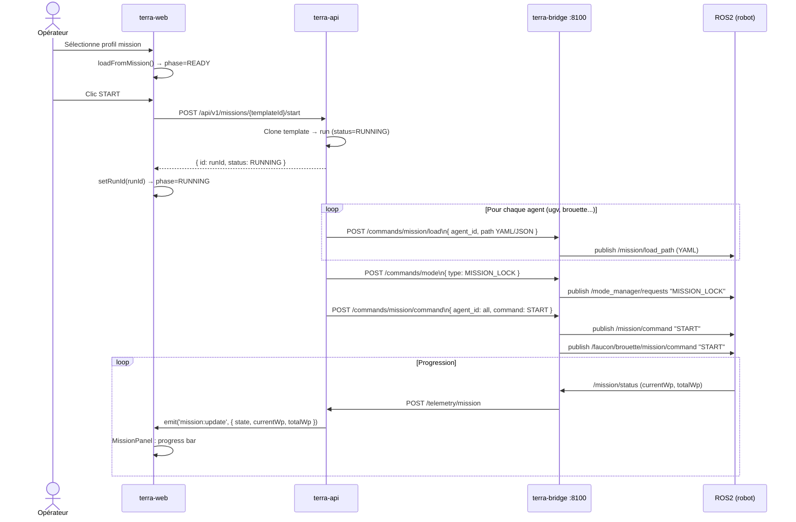
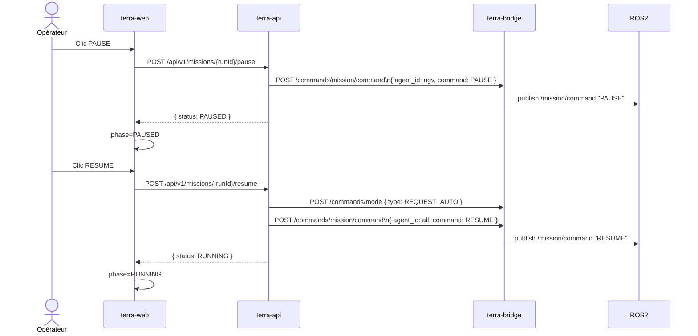
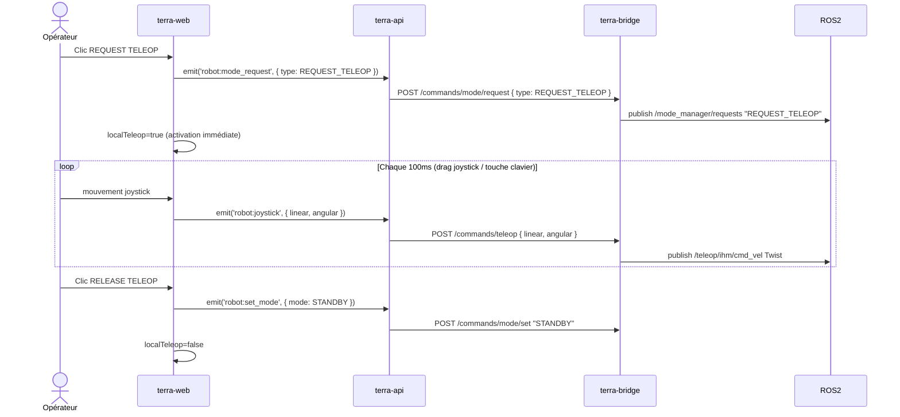
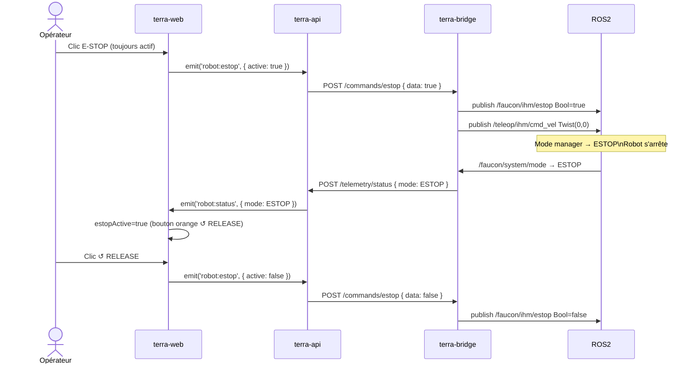
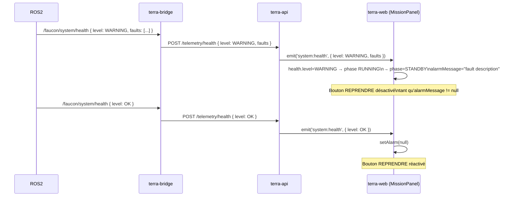
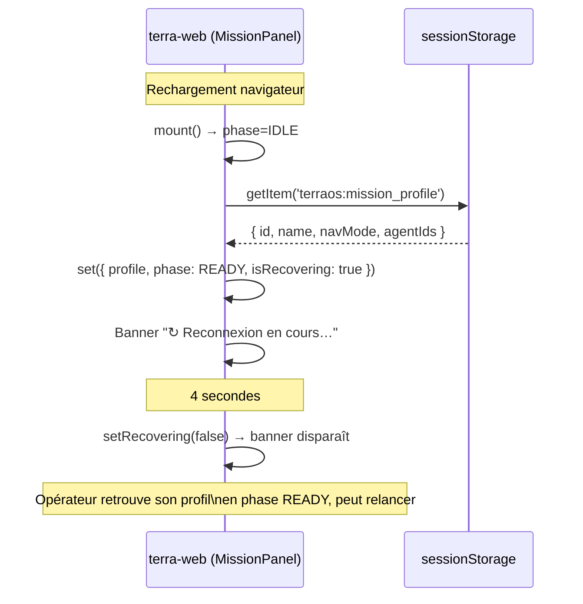

# TerraOS — Diagrammes de séquence

## 1. Authentification

---

## 2. Connexion temps réel (Socket.IO)

---

## 3. Démarrage d'une mission

---

## 4. Pause et reprise

---

## 5. Télé-opération (Joystick)

---

## 6. E-STOP

---

## 7. Transition STANDBY (alerte santé)

---

## 8. Récupération de session (rechargement page)

